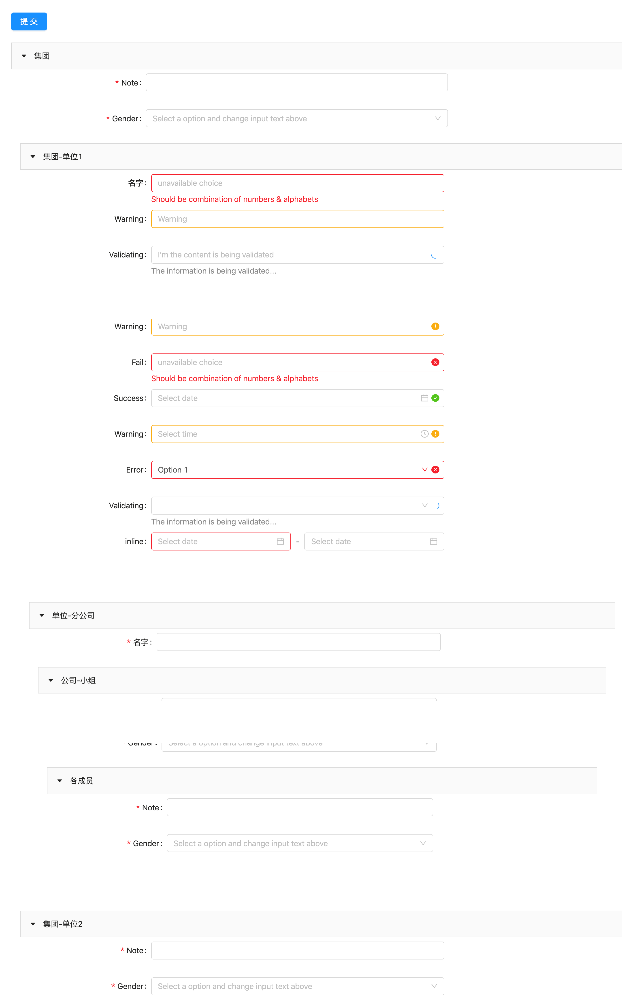
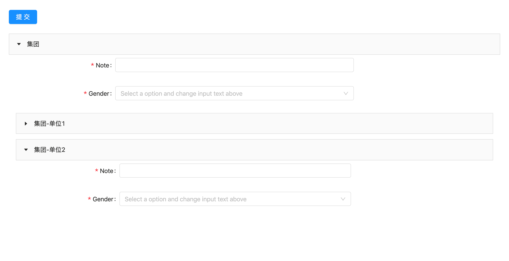

# vue-tree-forms

## Project setup

```
npm install
```

## 预览

> 在线预览地址

- [【码云-国内访问更快】](http://perfect_l.gitee.io/vue-tree-forms/)
- [【github-国内访问很慢】](https://luohong123.github.io/vue-tree-forms/)

  

  

### Compiles and hot-reloads for development

```
npm run serve
```

### Compiles and minifies for production

```
npm run build
```

### Lints and fixes files

```
npm run lint
```

### Customize configuration

See [Configuration Reference](https://cli.vuejs.org/config/).
